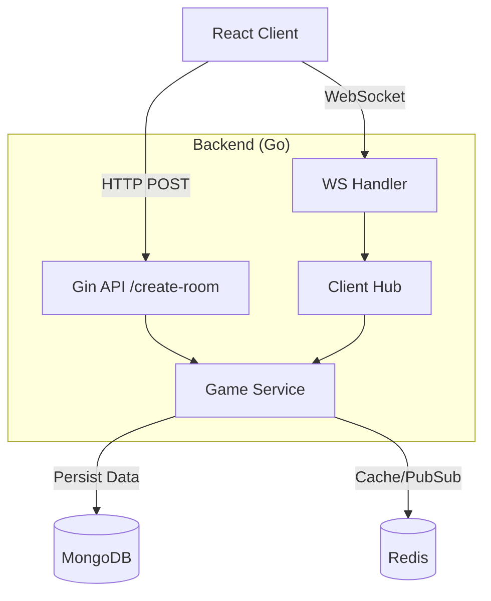

# 🚀 Space Striker - Backend

**Space Striker** is a real-time, multiplayer strategy game backend inspired by the classic "Battleship" board game. This service handles game state management, player matchmaking, and real-time communication using WebSockets and Redis Pub/Sub to ensure low-latency gameplay.

## 📖 Table of Contents

- [Architecture](#🏗-architecture)
- [Tech Stack](#🛠-tech-stack)
- [Project Structure](#📂-project-structure)
- [Features](#features)
- [Getting Started](#🚀-getting-started)
- [Environment Variables](#🔐-environment-variables)
- [To-Do list](#general-to-do-list)

## 🏗 Architecture

The backend follows a **Clean Architecture** approach. It uses HTTP (Gin) for initial room creation and auth, then upgrades the connection to WebSockets (Gorilla) for gameplay events. Redis is utilized for high-speed game state caching and managing concurrency.



## 🛠 Tech Stack

- **Framework** : Gin _(High-performance HTTP web framework)_

- **Real-time** : Gorilla/Websocket _(WebSocket implementation for Go)_

- **Database** : MongoDB _(NoSQL database for persistent user/match history)_

- **Caching** : Redis _(In-memory store for active game sessions & Pub/Sub)_

- **Container** : Docker _(Application containerization)_

## 📂 Project Structure

This project follows the **Standard Go Project Layout**.

```
my-project/
├── cmd/
│   └── api/
│       └── main.go           # Entry point: Wires server, db, and config
├── internal/
│   ├── config/               # Env vars and configuration struct
│   ├── models/               # Domain entities (User, GameState, Ship)
│   ├── server/               # HTTP Server setup (CORS, Middlewares)
│   ├── handlers/             # TRANSPORT LAYER
│   │   ├── http/             # REST Endpoints (Auth, Room Gen)
│   │   │   └── user_http.go
│   │   └── ws/               # WebSocket Logic
│   │       ├── client.go     # Read/Write pump for sockets
│   │       ├── hub.go        # Manages active connections/rooms
│   │       └── ws_handler.go # WS Upgrade handler
│   ├── service/              # BUSINESS LOGIC LAYER
│   │   ├── user_service.go
│   │   └── game_service.go   # Game rules, hit/miss logic
│   └── repository/           # DATA ACCESS LAYER
│       ├── mongodb/          # MongoDB implementations
│       │   └── user_repo.go
│       └── redis/            # Redis implementations
│           └── game_cache.go
├── pkg/                      # Public Utilities
│   ├── logger/               # Structured logging setup
│   └── validator/            # Input validation helpers
├── api/                      # Open API Specs / Swagger
├── migrations/               # DB Migrations
├── Makefile                  # Build commands
└── Dockerfile                # Deployment config

```

## ✨ Features

- **Room Management:** API to generate unique Room IDs for private matches.
- **Real-time Gameplay:** Low latency state updates via WebSockets.
- **Game Logic:** Server-side validation of ship placement and hit/miss mechanics.
- **Concurrency Safe:** Uses Redis to handle state across concurrent requests.
- **Chat:** (Optional) In-game chat functionality.

## 🚀 Getting Started

### Prerequisites

- Go 1.24+
- Docker & Docker Compose
- Redis (running locally or via Docker)

### Installation

1. **Clone the repository**

   ```bash
   git clone [https://github.com/yourusername/space-striker-backend.git](https://github.com/yourusername/space-striker-backend.git)
   cd space-striker-backend

   ```

2. **Install Dependencies**

   ```bash
   go mod download

   ```

3. **Start Infrastructure (Redis/Mongo)**

   ```bash
   docker-compose up -d redis mongo

   ```

4. **Run the Server**

   ```bash
   make run
   # Or
   go run cmd/api/main.go

   ```

## 🔐 Environment Variables

Create a `.env` file in the root directory:

```
PORT=8080
ENV=development

# Database
MONGO_URI=mongodb://localhost:27017
DB_NAME=space_striker

# Redis
REDIS_ADDR=localhost:6379
REDIS_PASSWORD=

```

## 🤝 Contributing

1. Fork the Project
2. Create your Feature Branch (`git checkout -b feature/AmazingFeature`)
3. Commit your Changes (`git commit -m 'Add some AmazingFeature'`)
4. Push to the Branch (`git push origin feature/AmazingFeature`)
5. Open a Pull Request

## ✅ General To-Do List

**Inital Setup**

- [x] Readme Setup
- [ ] Folder setup
- [ ] basic server implementation
- [ ] database setup

**Core Features & Stability**

- [ ] Implement match-Making logic
- [ ] Add comprehensive unit tests for `game_service` logic (hit/miss validation).
- [ ] Implement user logic in HTTP server
- [ ] Implement game logic in websocket hub
- [ ] Implement graceful shutdown for HTTP server and WebSocket hub.
- [ ] Implement reconnect logic for WebSocket clients (handle temporary disconnects).
- [ ] Add request validation middleware using `go-playground/validator`.

**Infrastructure & DevOps**

- [ ] Set up GitHub Actions CI pipeline (lint, test, build).
- [ ] Add health check endpoints (`/health`, `/readiness`).
- [ ] Create a `docker-compose.prod.yml` for production deployment.

**Security**

- [ ] Implement JWT Authentication for player sessions.
- [ ] Rate limit WebSocket connections to prevent abuse.
- [ ] Sanitize chat inputs to prevent XSS/Injection.

**Documentation(might do this)**

- [ ] Generate Swagger/OpenAPI documentation (using `swaggo`).
- [ ] Document WebSocket event payloads (JSON structure for `fire`, `join`, `leave`).
