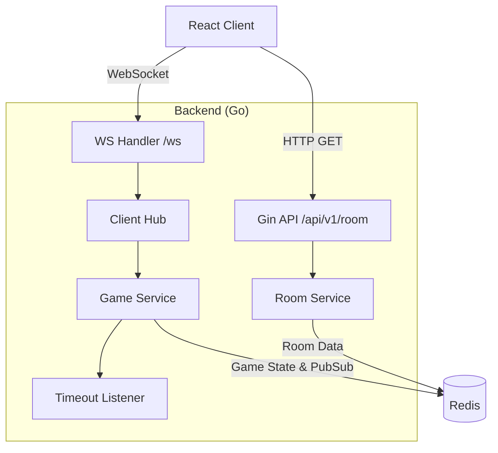

# 🚀 Space Striker - Backend

**Space Striker** is a real-time, multiplayer strategy game backend inspired by the classic "Battleship" board game. This service handles game state management, room creation, and real-time communication using WebSockets and Redis Pub/Sub to ensure low-latency gameplay.

## 🔗 Related

- **Frontend Repository** - [space-striker-client](https://github.com/Harish-Naruto/space-striker-client) (React TypeScript)

## 📖 Table of Contents

- [Architecture](#-architecture)
- [Tech Stack](#-tech-stack)
- [Project Structure](#-project-structure)
- [Features](#-features)
- [WebSocket Events](#-websocket-events)
- [Getting Started](#-getting-started)
- [Environment Variables](#-environment-variables)
- [Makefile Commands](#-makefile-commands)
- [Contributing](#-contributing)
- [To-Do List](#-general-to-do-list)

## 🏗 Architecture

The backend follows a **Clean Architecture** approach. It uses HTTP (Gin) for room creation, then upgrades the connection to WebSockets (Gorilla) for gameplay events. Redis is utilized for game state storage, turn timeouts via Pub/Sub, and managing concurrency.



## 🛠 Tech Stack

- **Framework** : Gin _(High-performance HTTP web framework)_
- **Real-time** : Gorilla/WebSocket _(WebSocket implementation for Go)_
- **Data Store** : Redis _(In-memory store for game state, rooms & Pub/Sub timeouts)_
- **Container** : Docker _(Application containerization)_

## 📂 Project Structure

This project follows the **Standard Go Project Layout**.

```
Space-Striker-Server/
├── cmd/
│   └── server/
│       └── main.go              # Entry point: Wires server, Redis, and routes
├── internal/
│   ├── game/
│   │   └── timer.go             # Turn/ship-placement timeout listener (Redis PubSub)
│   ├── models/
│   │   └── message.type.go      # WebSocket message type definitions
│   ├── handler/                  # TRANSPORT LAYER
│   │   ├── http_handler/
│   │   │   ├── handler.go       # HTTP handler struct
│   │   │   ├── auth.handler.go  # Auth handler (placeholder)
│   │   │   └── room.handler.go  # Room creation endpoint
│   │   ├── routes/
│   │   │   ├── auth.routes.go   # Auth routes (placeholder)
│   │   │   └── room.routes.go   # Room route registration
│   │   └── ws/                  # WebSocket Logic
│   │       ├── client.go        # Read/Write pump for sockets
│   │       ├── hub.go           # Manages active connections/rooms
│   │       └── wsHandler.go     # WS Upgrade handler
│   ├── infra/
│   │   └── redis.go             # Redis client initialization
│   ├── services/                # BUSINESS LOGIC LAYER
│   │   ├── room.service.go      # Room ID generation
│   │   ├── game.service.go      # Game rules, hit/miss, ship placement
│   │   └── chat.service.go      # In-game chat broadcast
│   └── repository/              # DATA ACCESS LAYER
│       ├── mongodb/
│       │   └── auth_repo.go     # (Placeholder for future use)
│       └── redis/
│           ├── game_repo.go     # Redis game state persistence
│           └── chat_repo.go     # Redis chat operations
├── pkg/                         # Public Utilities
│   └── domain/
│       ├── game.go              # Game domain logic (board, ships, cells)
│       ├── game_test.go         # Unit tests for game logic
│       └── room.go              # Room domain model
├── Makefile                     # Build commands
└── Dockerfile                   # Multi-stage Docker build (scratch)
```

## ✨ Features

- **Room Management:** API to generate unique Room IDs for private matches.
- **Real-time Gameplay:** Low-latency state updates via WebSockets.
- **Game Logic:** Server-side validation of ship placement (5 ships on a 5×5 board) and hit/miss mechanics.
- **Turn Timeouts:** Automatic turn expiry (40s per move, 60s for ship placement) via Redis Pub/Sub.
- **Reconnect Support:** Players can reconnect to an active game and receive full game state history.
- **In-game Chat:** Real-time chat messages broadcast to all players in a room.
- **Concurrency Safe:** Uses Redis to handle state across concurrent requests.

## 📡 WebSocket Events

Connect via `ws://<host>/ws?roomID=<id>&playerID=<id>`

| Event Type     | Direction       | Description                                      |
|----------------|-----------------|--------------------------------------------------|
| `PLACE_SHIP`   | Client → Server | Player places their 5 ships on the board         |
| `MOVE`         | Client → Server | Player fires at a coordinate (x, y)              |
| `CHAT`         | Client ↔ Server | In-game chat message                             |
| `GAME_STATE`   | Server → Client | Current board state (own board + opponent's view) |
| `GAME_UPDATE`  | Server → Client | Status updates (turn changes, phase transitions)  |
| `GAME_OVER`    | Server → Client | Game result with winner announcement              |
| `TIME_OUT`     | Server → Client | Turn or placement timeout notification            |
| `SYNC_TIME`    | Server → Client | Server time sync on connection                    |
| `ERROR`        | Server → Client | Error messages                                    |

## 🚀 Getting Started

### Prerequisites

- Go 1.25+
- Docker (for containerized deployment)
- Redis (running locally or via Docker)

### Installation

1. **Clone the repository**

   ```bash
   git clone https://github.com/Harish-Naruto/Space-Striker-Server.git
   cd Space-Striker-Server
   ```

2. **Install Dependencies**

   ```bash
   go mod download
   ```

3. **Start Redis**

   ```bash
   # Using Docker
   docker run -d --name redis -p 6379:6379 redis

   # Or ensure Redis is running locally on port 6379
   ```

4. **Run the Server**

   ```bash
   make run
   # Or
   go run cmd/server/main.go
   ```

   The server will start on `http://localhost:8080`.

## 🔐 Environment Variables

The server currently uses the following defaults (hardcoded in `cmd/server/main.go`):

| Variable       | Default           | Description                    |
|----------------|-------------------|--------------------------------|
| `PORT`         | `8080`            | Server port                    |
| `REDIS_ADDR`   | `localhost:6379`  | Redis connection address       |

> **Note:** Environment variable support is planned. Currently, Redis address and port are hardcoded in the source.

## 🛠 Makefile Commands

| Command      | Description                                 |
|--------------|---------------------------------------------|
| `make build` | Compile the server binary to `./bin/server` |
| `make run`   | Build and run the server                    |
| `make test`  | Run all tests (`go test ./...`)             |
| `make fmt`   | Format all Go source files                  |
| `make vet`   | Run `go vet` on all packages                |
| `make clean` | Remove build artifacts                      |
| `make docker`| Build and run via Docker Compose            |

## 🤝 Contributing

1. Fork the Project
2. Create your Feature Branch (`git checkout -b feature/AmazingFeature`)
3. Commit your Changes (`git commit -m 'Add some AmazingFeature'`)
4. Push to the Branch (`git push origin feature/AmazingFeature`)
5. Open a Pull Request

## ✅ General To-Do List

**Initial Setup**

- [x] Readme Setup
- [x] Folder setup
- [x] Basic server implementation
- [x] Redis connection setup

**Core Features & Stability**

- [x] Implement time-based turn limit and game limit
- [x] Implement game logic in WebSocket hub
- [x] Implement room creation via HTTP endpoint
- [x] Implement reconnect logic for WebSocket clients (handle temporary disconnects)
- [x] In-game chat functionality
- [ ] Add comprehensive unit tests for game service logic
- [ ] Implement graceful shutdown for HTTP server and WebSocket hub

**Infrastructure & DevOps**

- [ ] Set up GitHub Actions CI pipeline (lint, test, build)
- [ ] Add proper health check endpoints (`/health`, `/readiness`)
- [ ] Create a `docker-compose.yml` with Redis for local development
- [ ] Externalize configuration via environment variables

**Security**

- [ ] Implement authentication for room sessions
- [ ] Rate limit WebSocket connections to prevent abuse

**Documentation**

- [ ] Generate Swagger/OpenAPI documentation (using `swaggo`)
- [ ] Document WebSocket event payloads in detail (JSON structure examples)
